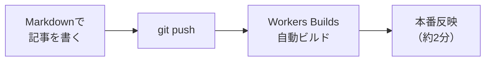

ここは技術メモ（memo）のサンプルです。記事にするほどではない小ネタ、気になったニュースの調査メモなどを気軽に置きます。

Qiita互換の `:::note` 記法が使えます。

:::note
補足やメモはこのボックスで書けます（info、既定）。
:::

:::note warn
注意してほしいことは warn で書きます。
:::

:::note alert
重要な警告は alert で書きます。
:::

:::note
ノートの中でもリンクカードが使えます（URLの前後に空行を入れるのがポイント）。

https://qiita.com/ryu-ki/items/0566e27e6c50b9fb399a

:::

Mermaid記法の図もブラウザ側でレンダリングされます。

