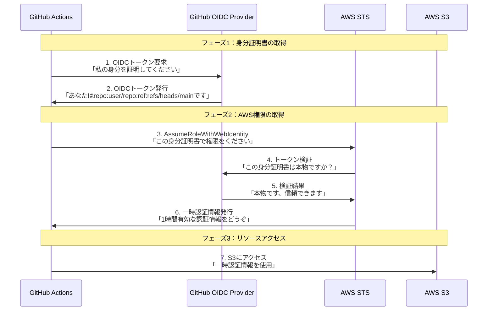

## はじめに

以前、CI/CDパイプラインでAWSリソースにアクセスする際に「AssumeRole + OIDC方式」を使った仕組みを構築しました。手順通りに設定して動作することは確認できましたが、振り返ってみると仕組みについての理解があいまいなままでした。そこで、自分の理解を整理するために、この仕組みについて改めて整理したいと思います。

なお、実際の設定手順については、以下の記事で詳しく解説していますので、そちらをご参照ください。

https://qiita.com/ryu-ki/items/cd9c85240b154a9580bb

本記事は仕組みの理解に重点を置いているため、上記記事と合わせて読んでいただけると、より理解が深まるかと思います。

## そもそもAssumeRoleとは？

AssumeRoleは、AWSで **「一時的にロールの権限を借りる」** 仕組みです。

### AssumeRoleの基本的な動作

AssumeRoleを実行すると、AWS STS（Security Token Service）が以下の一時認証情報を発行します。

- `AccessKeyId`：一時的なアクセスキーID
- `SecretAccessKey`：一時的なシークレットアクセスキー
- `SessionToken`：セッショントークン
- `Expiration`：有効期限


### 信頼ポリシーの役割

AssumeRoleが実行される際、IAMロールに設定された **信頼ポリシー** で「誰がこのロールを引き受けられるか」を制御します。

```json
{
  "Version": "2012-10-17",
  "Statement": [
    {
      "Effect": "Allow",
      "Principal": {
        "AWS": "arn:aws:iam::123456789012:user/example-user"
      },
      "Action": "sts:AssumeRole"
    }
  ]
}
```

この例では、特定のIAMユーザーのみがこのロールを引き受けられるよう制限しています。

## OIDCとは？

OIDC（OpenID Connect）は、**認証プロトコルの1つ**です。

具体的には、**「この人は確かに○○である」ということを証明するためのトークンを発行・検証する仕組み**です。GitHub ActionsやGitLab CIなどは、OIDCプロバイダーとして動作できます。

### OIDCトークンの中身

GitHub ActionsがOIDCプロバイダーとして動作し、以下のようなトークンを発行します。

```json
{
  "iss": "https://token.actions.githubusercontent.com",
  "sub": "repo:username/repository:ref:refs/heads/main",
  "aud": "sts.amazonaws.com",
  "repository": "username/repository",
  "ref": "refs/heads/main",
  "sha": "da39a3ee5e6b4b0d3255bfef95601890afd80709",
  "exp": 1721742600
}
```

#### それぞれの値の意味
- iss（issuer）：発行者（GitHubが発行）
- sub（subject）：主体（どのリポジトリ・ブランチからの実行か）
- aud（audience）：利用先（AWSで使用）
- repository：リポジトリ名（具体的なリポジトリ名）
- ref：ブランチ/タグ（mainブランチからの実行）
- sha：コミットハッシュ（具体的なコミット情報）
- exp：有効期限（いつまで有効か）

### OIDCの安全性
OIDCトークンには以下のセキュリティ特性があります。
- デジタル署名：GitHub（発行者）によってデジタル署名されており、改ざん検出が可能
- 短期間有効：通常15分程度で自動的に無効化
- 実行コンテキスト付き：どこから実行されているかが明確に記録
- 動的生成：実行時に動的に生成されるため、事前漏洩のリスクが低い

## AssumeRole + OIDC方式の仕組み

### 全体フロー
以下は、GitHub ActionsからS3バケットへアクセスする際のフロー図です。



### 信頼ポリシーの例
OIDC方式では、信頼ポリシーでより細かい制御が可能となっています。

```json
{
    "Version": "2012-10-17",
    "Statement": [
        {
            "Effect": "Allow",
            "Principal": {
                "Federated": "arn:aws:iam::XXXXXXXXXXXX:oidc-provider/token.actions.githubusercontent.com"
            },
            "Action": "sts:AssumeRoleWithWebIdentity",
            "Condition": {
                "StringEquals": {
                    "token.actions.githubusercontent.com:aud": "sts.amazonaws.com"
                },
                "StringLike": {
                    "token.actions.githubusercontent.com:sub": "repo:XXXXX/XXXXX:*"
                }
            }
        }
    ]
}
```

#### 条件について
- `aud`：AWSで使用することを想定したトークンのみ許可
- `sub`：特定のリポジトリからの実行のみ許可

さらに以下のような厳密な制御も可能です。
```json
{
    "Condition": {
        "StringEquals": {
            "token.actions.githubusercontent.com:aud": "sts.amazonaws.com",
            "token.actions.githubusercontent.com:ref": "refs/heads/main"
        },
        "StringLike": {
            "token.actions.githubusercontent.com:sub": "repo:mycompany/myapp:*"
        }
    }
}
```
この設定では「mycompany/myappリポジトリのmainブランチからの実行のみ」に制限されます。

### 詳細な流れ

#### 1. OIDCトークンの取得
GitHub ActionsがGitHub OIDC Providerに対してトークンを要求します。この際、GitHub Actions側では以下の権限設定が必要です。

```yaml
permissions:
  id-token: write  # OIDCトークンの取得に必要
  contents: read   # リポジトリ内容の読み取り
```

#### 2. OIDCトークンの発行
GitHub側でワークフローの実行コンテキストを確認し、OIDCトークンを発行します。

#### 3. AssumeRoleの実行
GitHub ActionsがAWS STSの`AssumeRoleWithWebIdentity` APIを呼び出します。

```bash
aws sts assume-role-with-web-identity \
  --role-arn arn:aws:iam::123456789012:role/GitHubActions-Role \
  --role-session-name "GitHubActions-Session" \
  --web-identity-token $OIDC_TOKEN
```

#### 4, 5. トークンの検証
AWS STSがOIDCトークンの署名を検証し、信頼できるプロバイダーからのものか確認します。

#### 6. 一時認証情報の発行
検証が成功すると、AWS STSが一時的なアクセスキー、シークレットキー、セッショントークンを発行します。

```json
{
  "Credentials": {
    "AccessKeyId": "ASIAXXX...",
    "SecretAccessKey": "xxx...",
    "SessionToken": "xxx...",
    "Expiration": "2025-07-13T15:30:00Z"
  },
  "AssumedRoleUser": {
    "AssumedRoleId": "AROAXX:GitHubActions-Session",
    "Arn": "arn:aws:sts::123456789012:assumed-role/GitHubActions-Role/GitHubActions-Session"
  }
}
```

#### 7. AWSリソースへのアクセス
取得した一時認証情報を使ってAWSリソースにアクセスします。

## まとめ
### ポイント
- AssumeRoleでAWSの一時認証情報を取得
- 信頼ポリシーで細かいアクセス制御が可能
- OIDCトークンでGitHub Actionsの実行コンテキストを証明

### メリット
- セキュリティ向上：短期間有効な認証情報により、長期的な漏洩リスクを軽減
- 管理負担軽減：アクセスキーの定期ローテーションが不要
- 細かい制御：リポジトリ、ブランチレベルでのアクセス制御が可能
- 監査性向上：実行コンテキストの詳細なログ記録

## おわりに
AssumeRole + OIDC方式の仕組みについて整理してみました。最初は「なんとなく動いている」状態でしたが、改めて仕組みを理解することで、設定の意味が分かった気がします。さらに理解を深めて、より安全で適切な設定ができるようになりたいと思います。
ありがとうございました。


## 参考

https://docs.github.com/ja/actions/concepts/security/openid-connect#getting-started-with-oidc

https://docs.github.com/ja/actions/deployment/security-hardening-your-deployments/about-security-hardening-with-openid-connect

https://docs.github.com/ja/actions/how-tos/security-for-github-actions/security-hardening-your-deployments/configuring-openid-connect-in-amazon-web-services

https://docs.aws.amazon.com/STS/latest/APIReference/API_AssumeRoleWithWebIdentity.html

https://docs.aws.amazon.com/ja_jp/IAM/latest/UserGuide/id_credentials_temp_use-resources.html

https://www.fortinet.com/jp/resources/cyberglossary/oidc

https://zenn.dev/fusic/articles/48620c1c798ece

https://zenn.dev/fdnsy/articles/e98c43d9c3f611
