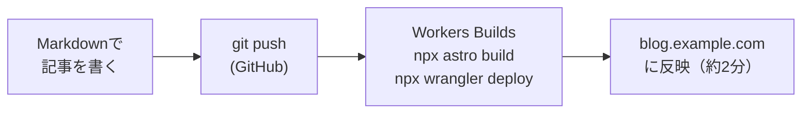

## はじめに

Astro と Cloudflare Workers で個人ブログを作りました。今ご覧いただいている、このブログのことです。


この記事では、同じ構成でブログを構築する手順について書きたいと思います。

:::note
作業は Claude（Fable 5）と一緒に進めました。本記事の画面や仕様は 2026 年 7 月時点のものです。
:::

### Astro とは

Astro は、ブログやドキュメントのようなコンテンツ主体のサイトに特化した Web フレームワークです。

https://astro.build/

この記事を読むうえで押さえておきたい特徴は 3 つあります。

1 つ目は、ビルド時に全ページを静的な HTML にする、いわゆる静的サイトジェネレーター（SSG）であることです。サーバーで都度レンダリングしないので、配信は「できあがったファイルを置くだけ」になります。

2 つ目は、デフォルトでは JavaScript を出力しないことです。React などのコンポーネントを部分的に埋め込む仕組み（アイランドアーキテクチャ）もありますが、ブログなら素の HTML だけで完結します。

3 つ目は、コンテンツコレクションという記事管理の標準機能があることです。Markdown の frontmatter にスキーマ（型）を定義でき、`title` の書き忘れのようなミスをビルド時に検出してくれます。

ざっくり「Markdown で書いて、ビルドすると静的な HTML 一式ができる」と理解しておけば、この記事を読むには十分かと思います。

### なぜこの構成か

静的サイトを Cloudflare に置く場合、以前は Cloudflare Pages が定番でした。しかし Cloudflare は 2026 年 2 月に「新規の静的サイトは Workers（static assets）を推奨し、今後の投資は Workers に集中する」と表明しています。

https://blog.cloudflare.com/full-stack-development-on-cloudflare-workers/

また 2026 年 1 月には Cloudflare が Astro の開発元を買収しており（Astro 自体は OSS のまま）、Astro 公式のデプロイガイドも Workers 主軸に書き換えられました。これから新しく作るなら Astro + Workers が素直な選択だと思います。

Astro を選んだ理由はシンプルで、Markdown でブログを書くことに特化した仕組みが標準装備されていることに加えて、ビルド成果物がただの静的ファイル群になるからです。仮に将来 Cloudflare をやめたくなっても、`dist/` をどこにでも持っていけます。（あと Twitter で catnose さんが話題に上げていたことも一因です）

## 前提環境

| 項目 | バージョン |
|------|-----------|
| Astro | 7.0.6 |
| Node.js | 22.16.0（Workers Builds のビルド環境） |
| npm | 10.9.2（同上） |
| ローカル環境 | macOS / Node.js 25 系 |

## 全体像

完成形のデプロイフローは次のとおりです。



必要なものは、独自ドメインと GitHub アカウント、そして Cloudflare アカウントの 3 つです。Cloudflare は Free プランで十分で、クレジットカードの登録も要りません。

1 点だけ重要な前提があります。Workers のカスタムドメインには、Cloudflare が DNS をホストしているゾーンが必須です。

https://developers.cloudflare.com/workers/configuration/routing/custom-domains/

ドメインの DNS を Route 53 など他社で運用している場合は、DNS ホスティングを Cloudflare へ移す必要があります。レジストラの移管は不要で、ネームサーバーの向き先を変えるだけです。この移行は別記事にまとめたので、該当する方はこちらをご覧ください。

https://qiita.com/ryu-ki/items/0566e27e6c50b9fb399a

## 1. Astro でブログの骨組みを作る

公式の blog テンプレートから始めます。

```bash
npm create astro@latest my-blog -- --template blog --install --git
```

これだけで、記事一覧・記事ページ・RSS・サイトマップ・OGP タグまで揃ったブログが生成されます。`npm run dev` で http://localhost:4321 を開けばすぐ動きます。

### コンテンツコレクションでセクションを分ける

テンプレートは blog という単一コレクションですが、私は「技術記事」「旅の記録」のように複数のセクションへ分けたかったので、`src/content.config.ts` を書き換えました。共通の frontmatter スキーマを関数にしておくと、セクションごとの拡張がきれいに書けます。

```ts
// src/content.config.ts（抜粋）
const baseSchema = ({ image }: any) =>
	z.object({
		title: z.string(),
		description: z.string(),
		pubDate: z.coerce.date(),
		updatedDate: z.coerce.date().optional(),
		heroImage: z.optional(image()),
		tags: z.array(z.string()).default([]),
		draft: z.boolean().default(false),
	});

const tech = defineCollection({
	loader: glob({ base: './src/content/tech', pattern: '**/*.{md,mdx}' }),
	schema: (ctx: any) => baseSchema(ctx).extend({ qiitaId: z.string().optional() }),
});

const travel = defineCollection({
	loader: glob({ base: './src/content/travel', pattern: '**/*.{md,mdx}' }),
	schema: (ctx: any) => baseSchema(ctx).extend({ location: z.string().optional() }),
});
```

セクションの追加は、コレクション定義を数行書いて、一覧・詳細・RSS のページを複製するだけで完結します。

また、`draft: true` の記事を一覧・RSS・ページ生成から除外するようにしておくと、書きかけを push しても公開されないので安心です。

### Workers 用の設定ファイルを置く

リポジトリ直下に `wrangler.jsonc` を作ります。静的サイトの場合、設定は以下の通りになります。

```jsonc
{
	"name": "my-blog",
	"compatibility_date": "2026-07-04",
	"assets": {
		"directory": "./dist"
	}
}
```

:::note warn
Workers の名前にドットは使えません。私のサイト名は mcks.log ですが、Worker 名は mcks-log にしています。
:::

SSR をしない静的出力なら `@astrojs/cloudflare` アダプターは不要です。`npm run build` で `dist/` に静的ファイルが出ることを確認しておきましょう。

## 2. Workers Builds で GitHub と繋ぐ

リポジトリを GitHub に push したら、Cloudflare ダッシュボードで Workers Builds（Git 連携の CI/CD）を設定します。

https://developers.cloudflare.com/workers/ci-cd/builds/

ダッシュボードの Compute (Workers) から Workers & Pages → Create と進むと「Ship something new」という画面になるので、Connect GitHub を選びます。


GitHub 側で Cloudflare Workers & Pages アプリを Install & Authorize したら、あとはリポジトリを選んでビルド設定を入力するだけです。


:::note
アプリに渡すリポジトリのスコープは、Only select repositories で対象リポジトリだけに絞っておくのがおすすめです。
:::


ビルド設定は次のようにしました。

```text
プロジェクト名:   my-blog（wrangler.jsonc の name と揃える）
Production branch: main
Build command:     npx astro build
Deploy command:    npx wrangler deploy
```


Deploy を押すと初回ビルドが走ります。ビルド環境は Node.js のバージョンを自動検出してくれて（この時は 22.16.0 でした）、依存キャッシュも初回から効きます。全体で 2 分弱でした。


ここまで触ってみて AWS Amplify Hosting と同じような使い勝手に感じました。


## 3. カスタムドメインの設定

ここがこの構成でいちばん便利なところかと思います。`wrangler.jsonc` に routes を足して push すると、デプロイ時に DNS レコードの作成から TLS 証明書の発行までが自動で終わります。

```jsonc
{
	"name": "my-blog",
	"compatibility_date": "2026-07-04",
	"assets": {
		"directory": "./dist"
	},
	"routes": [
		{ "pattern": "blog.example.com", "custom_domain": true }
	]
}
```

私の場合、ビルド完了から数十秒で `https://blog.ryu-ki-learn.com` が HTTPS で疎通しました。ダッシュボード側の操作は何も要りません。

条件は 2 つです。ゾーンが同一 Cloudflare アカウントで Active になっていることと、同名の DNS レコードが既に存在しないことです。事前に `dig` コマンドを実行して、NXDOMAIN が返る（レコードがまだ無い）ことを確認しておくと安心です。

## 4. workers.dev の無効化

Workers で公開したサイトには、カスタムドメインとは別に `<name>.<account>.workers.dev` という URL が最初から付いています。つまりこのままだと、同じサイトが 2 つの URL で公開されている状態です。検索エンジンに重複コンテンツとみなされる可能性があるので、workers.dev 側は無効にしておきます。これも設定ファイルに書きます。

```jsonc
	// wrangler.jsonc に追記
	"workers_dev": false,
	"preview_urls": true
```

ダッシュボードからも無効化できますが、設定ファイルを直さないと次のデプロイで復活します。wrangler.jsonc が真実の情報源として扱われるためで、こういう設定はコードで管理するのが正解です。

:::note
preview_urls は PR ごとのプレビュー URL 機能です。デフォルトでは workers_dev の値に連動してオフになってしまうため、明示的に true にしています。
:::

## こけたところ

構築中に一度だけビルドが失敗しました。remark プラグインを `npm install` で追加して push したら、Workers Builds のログに次のエラーが出ました。

```text
npm error `npm ci` can only install packages when your package.json and
package-lock.json or npm-shrinkwrap.json are in sync.
npm error Missing: @emnapi/runtime@1.11.2 from lock file
```

原因は npm の既知の問題です。依存パッケージの中には「Linux でだけ必要」といった OS 別のものがあり、Mac で `npm install` すると、それがロックファイルに書き込まれないことがあります。手元では動くのに、Linux のビルド環境で `npm ci` した瞬間に「ロックファイルに無い」と落ちるわけです。

そのため、ロックファイルを作り直して対処します。

```bash
rm -rf node_modules package-lock.json
npm install
npm clean-install   # ビルド環境と同じコマンドが通ることを確認してからpush
```

以後、パッケージを追加したときは push 前に `npm clean-install` で（Claudeが）確認するようにしています。


## 運用コスト

軽く触れておくと、この構成の Cloudflare 側は全部無料です。静的アセットの配信はリクエスト数・帯域とも無制限で、DNS クエリも無制限、証明書も無料、ビルドは月 3,000 分（1 回 2 分なら 1,500 回の push 相当）まで無料です。

https://developers.cloudflare.com/workers/static-assets/billing-and-limitations/

Cloudflare の Free プランは、無料枠を超えたときに自動課金されるのではなくエラーになります。想定外の請求が構造的に起きない、個人運用にはありがたい設計です。

残る費用はドメインの更新料（レジストラ次第で年 1,500〜2,500 円程度）くらいで、月額に直すと 200 円前後です。運用はほぼ 0 円でできると言っていいくらいですね。

## おわりに

以上、Astro の blog テンプレートと Workers static assets で、ブログの骨組みを作ってみました。このあと、リンクカードや `:::note` 記法など、書き味を Qiita に寄せるカスタマイズもいろいろやったのですが、長くなるのでまた別の機会に書けたら書きます。

骨組み自体はできましたが、デザインがまだまだ荒削り（というかAI任せ）なので今後ちょこちょこ改善していければと思います。

ありがとうございました。
