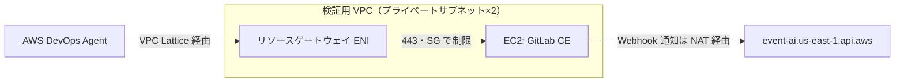

## はじめに

2026年3月に GA（一般提供開始）された AWS DevOps Agent を最近よく触っています。インシデント調査やリリース前のコードレビューを自動でやってくれる、いわゆる frontier agent（自律的にタスクをこなす最先端の AI エージェント）の一つです。

https://docs.aws.amazon.com/devopsagent/latest/userguide/about-aws-devops-agent.html

DevOps Agent は GitLab とも連携できるのですが、公式ドキュメントにはこう書いてあります。

> Currently, only publicly accessible GitLab instances are supported.

https://docs.aws.amazon.com/devopsagent/latest/userguide/connecting-to-cicd-pipelines-connecting-gitlab.html

社内の VPC に閉じた GitLab は対象外に読めます。一方で、VPC 内のプライベートなサービスに DevOps Agent を繋ぐ Private Connections という機能のブログがちょうど出ていました。

https://aws.amazon.com/jp/blogs/news/securely-connect-aws-devops-agent-to-private-services-in-your-vpcs/

ただ、このブログの実例は Grafana で、GitLab を繋ぐ手順はどこにもドキュメント化されていません。実際どうなのか、VPC 内に完全非公開の GitLab を立てて試してみました。

## 動作環境

| 項目 | バージョン |
|------|-----------|
| AWS CLI | 2.35.14 |
| AWS CDK | 2.1126.0 |
| GitLab CE | 19.1.1 |
| EC2 | t3.large / Ubuntu 24.04 |
| リージョン | us-east-1 |

:::note
本記事の内容は、2026年7月上旬時点の検証内容に基づきます。DevOps Agent は GA 直後のサービスなので、仕様が変わっている可能性がある点はご承知おきください。
:::

## Private Connections の仕組み

Private Connections は Amazon VPC Lattice をベースにした機能です。接続を作成すると、DevOps Agent がユーザーの VPC 内にリソースゲートウェイ（Resource Gateway）を作り、指定したサブネットに ENI（Elastic Network Interface）を配置します。DevOps Agent からの通信はこの ENI を入口として VPC に入り、セキュリティグループでフィルタされた上で対象サービスに届きます。（アーキテクチャ図は以下のブログから引用しています）


https://aws.amazon.com/blogs/devops/securely-connect-aws-devops-agent-to-private-services-in-your-vpcs/

対象サービスにパブリック IP もインターネットゲートウェイも不要で、通信はすべて AWS ネットワーク内で完結します。

リソースゲートウェイは DevOps Agent 管理のリソース（AWSAIDevOpsManaged タグ付き・アカウント内では読み取り専用）で、トラフィック制御用のセキュリティグループだけがユーザー側の管理です。

### 名前解決について

ブログには、ホストアドレスに DNS 名を使う場合はパブリックに名前解決できる必要がある（プライベートホストゾーンだけで解決できる名前は使えない）と書いてありました。

ところが `aws devops-agent create-private-connection help` を眺めていたら、こんなスキーマが出てきました。

```json
{
  "serviceManaged": {
    "hostAddress": "string",
    "vpcId": "string",
    "subnetIds": ["string", ...],
    "securityGroupIds": ["string", ...],
    "portRanges": ["string", ...],
    "certificate": "string",
    "dnsResolution": "PUBLIC"|"IN_VPC"
  }
}
```

dnsResolution に IN_VPC という選択肢があります。VPC 内の DNS で名前解決してくれるなら、プライベートホストゾーンがそのまま使えるはずです。certificate というフィールドもあるので、自己署名証明書もいけそうです。どちらもブログや公式ドキュメントには載っていません。

さらに `register-service help` を見ると、サービス種別の選択肢に gitlab があり、`--private-connection-name` というパラメータもありました。GitLab とプライベート接続の組み合わせは、API 設計としては最初からサポートされている形です。あとは実際に通るかどうかです。

## 検証環境の作成

VPC とプライベートサブネット2つ（2AZ）、その中に GitLab CE を入れた EC2 を CDK で立てました。パブリック IP なし、インバウンドはリソースゲートウェイ用セキュリティグループからの 443 のみという完全非公開の構成です。GitLab のインストールとアップデート用に NAT Gateway だけ置いています（アウトバウンド専用なので非公開性は崩れません）。



セキュリティグループはお互いを参照させる形にしました。

```typescript
resourceGatewaySg.addEgressRule(gitlabSg, ec2.Port.tcp(443), 'to GitLab HTTPS');
gitlabSg.addIngressRule(resourceGatewaySg, ec2.Port.tcp(443), 'from Resource Gateway');
```

DNS は Route 53 のプライベートホストゾーン devops-verify.internal を VPC に関連付け、gitlab.devops-verify.internal で EC2 のプライベート IP を引けるようにしました。TLS はこの FQDN（完全修飾ドメイン名）を SAN（Subject Alternative Name）に入れた自己署名証明書を EC2 上で生成し（SSM 経由で以下のようなコマンドを実行）、GitLab の external_url を https に設定しています。この証明書の PEM は、後述するプライベート接続の作成時に certificate パラメータとしてそのまま渡します。

```bash
openssl req -x509 -newkey rsa:2048 -nodes \
    -keyout gitlab.key -out gitlab.crt -days 365 \
    -subj "/CN=gitlab.devops-verify.internal" \
    -addext "subjectAltName=DNS:gitlab.devops-verify.internal,IP:<EC2のプライベートIP>"
```

管理アクセスは SSM Session Manager のポートフォワードを使いました。SSH ポートも踏み台も不要で、ローカルの https://localhost:8443 から GitLab の Web UI に届きます（自己署名証明書なのでブラウザ警告は出ますが、そのまま進めば OK です）。

```bash
aws ssm start-session \
    --target i-xxxxxxxxxxxxxxxxx \
    --document-name AWS-StartPortForwardingSession \
    --parameters '{"portNumber":["443"],"localPortNumber":["8443"]}'
```

GitLab 側では Personal Access Token（PAT）を発行し、サンプルプロジェクト root/sample-app を作って .gitlab-ci.yml をコミットしておきます。（ちなみに PAT のスコープはドキュメント推奨の5つのうち、read_registry だけが GitLab 19.1 に存在せずスキップになりました）

## DevOps Agent と GitLab の接続

### プライベート接続の作成

いよいよ本題です。IN_VPC と自己署名証明書を指定し接続していきます。

```bash
aws devops-agent create-private-connection \
    --name gitlab-connection \
    --mode '{
        "serviceManaged": {
            "hostAddress": "gitlab.devops-verify.internal",
            "vpcId": "vpc-xxxxxxxxxxxxxxxxx",
            "subnetIds": ["subnet-xxxx", "subnet-yyyy"],
            "securityGroupIds": ["sg-xxxxxxxxxxxxxxxxx"],
            "portRanges": ["443"],
            "certificate": "-----BEGIN CERTIFICATE-----\n...\n-----END CERTIFICATE-----\n",
            "dnsResolution": "IN_VPC"
        }
    }'
```

すんなり受理され、約3分で ACTIVE になりました（ブログには最大10分とありました）。プライベートホストゾーンの名前も自己署名証明書も、あっさり通りました。


VPC コンソールには aidevops-gitlab-connection というリソースゲートウェイが自動作成されており、DNS 解決タイプが VPC 内になっています。


### GitLab の登録

次に、この接続を使って GitLab をアカウントレベルで登録します。

https://docs.aws.amazon.com/cli/latest/reference/devops-agent/register-service.html

```bash
aws devops-agent register-service \
    --service gitlab \
    --private-connection-name gitlab-connection \
    --name gitlab-private \
    --service-details '{
        "gitlab": {
            "targetUrl": "https://gitlab.devops-verify.internal",
            "tokenType": "personal",
            "tokenValue": "<GitLabのPAT>"
        }
    }'
```

これも成功して serviceId が返ってきました。コンソールの機能プロバイダー画面にも、登録済みとして表示されます。


ちなみにコンソールから GitLab を登録しようとすると、選択肢は GitLab.com とパブリックにアクセス可能なセルフホストの2つだけで、プライベート接続を選ぶ UI はありません。この経路は現状 CLI（API）専用のようです。

### Agent Space への紐付け

最後に、Agent Space へプロジェクトを紐付けます。

https://docs.aws.amazon.com/cli/latest/reference/devops-agent/associate-service.html

```bash
aws devops-agent associate-service \
    --agent-space-id <Agent SpaceのID> \
    --service-id <register-serviceで返ったID> \
    --configuration '{
        "gitlab": {
            "projectId": "1",
            "projectPath": "root/sample-app",
            "instanceIdentifier": "gitlab.devops-verify.internal"
        }
    }'
```

このレスポンスに webhook というフィールドが含まれており、GitLab 側のプロジェクト設定を見に行くと…


aidevops という名前の Webhook が勝手に生えていました。説明文は AWS DevOps Agent managed webhook、作成時刻は associate-service 実行の2秒後です。

つまり、DevOps Agent がプライベート接続越しに GitLab の API を叩いた、ということです。インターネットから一切アクセスできない GitLab に、VPC Lattice 経由の通信が実際に成立していることが確認できました。

## マージリクエストの自動レビュー

接続できただけでは面白くないので、リリース前コードレビュー（Release readiness code review）まで試します。

https://docs.aws.amazon.com/devopsagent/latest/userguide/release-management-release-readiness-code-review.html

:::note
なお、リリース管理機能は2026年7月時点でプレビュー段階・us-east-1 のみ対応です。（今回の検証は us-east-1 なのでそのまま使えます）
:::

注意点として、コンソールから接続した場合は自動レビューがデフォルト有効とドキュメントにあるのですが、CLI の associate-service では capabilities を指定しない限り有効になりませんでした。update-association で後から有効化できます（configuration の再指定が必須です）。

https://docs.aws.amazon.com/cli/latest/reference/devops-agent/update-association.html

```bash
aws devops-agent update-association \
    --agent-space-id <ID> \
    --association-id <ID> \
    --configuration '{"gitlab": {...}}' \
    --capabilities 'RELEASE_READINESS_REVIEW={enabled=true}'
```

そして、わざと問題を仕込んだ deploy.sh のマージリクエストを（Claude Codeが）作りました。ハードコードされたパスワード、全部失敗しても exit 0 になるリトライループ、リポジトリに存在しないスクリプトの呼び出し、の3点盛りです。

```bash
#!/bin/bash
# デプロイスクリプト v2
DB_PASSWORD="changeme123"
echo "Deploying with retry..."
for i in 1 2 3; do
  ./run_deploy && break
  sleep 5
done
```

MR を更新して約8分後、インラインコメントが3件付きました。


仕込んだ3つの問題が全部検出されています。特によくできているなと思ったのが、リトライループの指摘で、3回全部失敗すると最後に実行されるのが sleep 5 なのでスクリプトが exit 0 で終わり、CI からは成功に見える、という因果まで説明した上で、明示的に exit 1 する修正案をコードブロック付きで提案してきました。

なお、コメントの投稿者は DevOps Agent 専用のユーザーではなく、登録した PAT のユーザー名義になります。スクリーンショットで root（Administrator）として投稿されているのはそのためです。

DevOps Agent コンソール側にもレビュー結果のレポートが生成されていました。推奨アクションは BLOCK、3件とも CRITICAL 判定です。


MR の diff 取得もコメント投稿もすべてプライベート接続経由なので、これで双方向のフルサイクルが検証できたことになります。

## 注意点

### Webhook 通知だけは VPC の外

プライベート接続が担うのは、DevOps Agent → GitLab 方向の通信（diff の取得やコメント投稿）だけです。逆方向、つまり「MR が更新されたよ」と GitLab が DevOps Agent に知らせる Webhook 通知は、event-ai.us-east-1.api.aws というインターネット上のエンドポイント宛てに送られます。

そのため、GitLab 側から外に出る経路が最低ひとつ必要です。今回は NAT Gateway があったのでそのまま届きましたが、NAT すら置かない完全閉域の構成では、Webhook が届かず自動レビューが動きません。その場合は aidevops 系の PrivateLink VPC エンドポイントを追加することになります。

### 作成したリソースの削除順について

プライベート接続を作ると、リソースゲートウェイの ENI が自分の VPC のサブネット内に置かれます。この ENI は DevOps Agent 管理なので自分では消せず、残ったまま CloudFormation で VPC を消そうとすると削除に失敗します。

先に delete-private-connection を実行し、describe-private-connection が ResourceNotFoundException を返す（＝削除完了）のを待ってから、インフラ側を削除しましょう。私の環境では削除完了まで5〜6分ほどかかりました。

## 料金と後片付け

検証にかかったインフラは、t3.large が約 0.083/h ドル、NAT Gateway が約 0.045/h ドル、あとは EBS くらいです。DevOps Agent 本体はエージェント稼働時間の秒単位課金で、AWS Support プランに応じた月額クレジットの範囲でした。半日で終わらせれば全部で数ドルに収まります。

後片付けは、DevOps Agent 側のリソースを CLI で消してから、検証環境（CDK で立てた VPC と EC2）をスタックごと削除する、という順で一発です。前述の削除順の注意のとおり、プライベート接続の削除完了を待ってから cdk destroy を実行します。

```bash
aws devops-agent disassociate-service --agent-space-id <ID> --association-id <ID>
aws devops-agent deregister-service --service-id <ID>
aws devops-agent delete-private-connection --name gitlab-connection
# 接続の削除完了を待ってから、検証環境(VPC/EC2)をスタックごと削除
cdk destroy
```

## おわりに

以上、簡単ではありましたが、VPC 内の完全非公開なセルフホスト GitLab でも、Private Connections を使えば AWS DevOps Agent に繋げることが確認できました。

今後は社内 GitLab を調査対象にしたインシデント対応の検証などもやってみたいと思います。

ありがとうございました。
