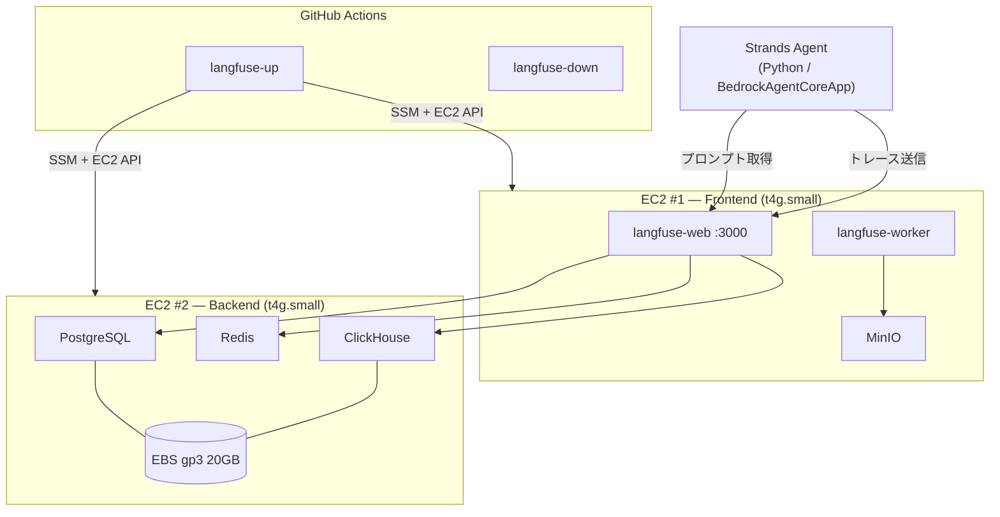

## はじめに

AI エージェントを開発していると、プロンプトをコード外から管理したい、エージェントの挙動をトレースして可視化したいという場面が出てきます。

Langfuse はこの両方を提供してくれるオープンソースのプラットフォームですが、SaaS 版は PoC にはやや重く、データを外に出したくないケースもあります。そこで今回は、Langfuse をセルフホストして EC2 × 2台で月ほぼ0円運用する構成を作りました。

起動・停止は GitHub Actions でチーム全員がワンクリックで実行でき、使う時だけ起動できるようにしています。

以下がリポジトリです。

https://github.com/ryuki-imachi/langfuse-on-ec2

:::note warn
本記事の構成は PoC 向けです。本番運用では ALB + HTTPS、プライベートサブネット、Aurora 等の検討が必要です。
:::

## 前提環境

- AWS アカウント（個人、東京リージョン）
- AWS CDK v2（TypeScript）
- Langfuse v3
- GitHub リポジトリ（GitHub Actions の workflow_dispatch を使用）

## 構成の全体像



Langfuse が担う役割は Prompt Management（プロンプトのバージョン管理と切り替え）と Tracing（エージェントの各ステップの可視化）の2つです。

## なぜ EC2 × 2台構成なのか

Langfuse の公式ドキュメントでは ECS (Fargate) を使ったデプロイ方法が紹介されています。

https://langfuse.com/self-hosting/deployment/aws-ecs

ただ、PoC 用途だとコンテナの常時稼働コストが気になりました。ALB + Fargate + Aurora を立てると、使っていない時間も課金が走ります。

そこで、EC2 t4g.small の無料枠（2026年12月末まで、月750時間）を活用して、docker compose で直接動かす構成にしました。使う時だけ起動する運用にすれば、2台合算でも月375時間（平日8時間 × 23日）まで無料です。

https://aws.amazon.com/ec2/instance-types/t4/

### 2台に分けた理由と役割分担

Langfuse v3 のセルフホストには langfuse-web、langfuse-worker、PostgreSQL、Redis、ClickHouse、S3 互換ストレージ（MinIO）の6つのコンテナが必要です。これを t4g.small（2GB RAM）1台に全部載せると、ClickHouse がメモリを食って他のコンテナを巻き添えにする OOM のリスクがあります。

そこで、ステートレスな Frontend（langfuse-web、worker、MinIO）と、ステートフルな Backend（PostgreSQL、Redis、ClickHouse）の2台に分離しました。

| | EC2 #1 (Frontend) | EC2 #2 (Backend) |
|---|---|---|
| コンテナ | langfuse-web, worker, MinIO | PostgreSQL, Redis, ClickHouse |
| EBS | root 10GB のみ | root 10GB + data 20GB |
| 性質 | ステートレス（壊れても再作成可） | ステートフル（データ永続化） |

こう分けることで、ClickHouse が暴れても Web UI に影響しない、DB だけ再起動したい場面で Frontend を巻き込まない、Backend だけ `t4g.medium` に上げるといった判断がしやすくなります。

:::note info
MinIO は Langfuse v3 で必要になった S3 互換のオブジェクトストレージです。イベントデータやメディアファイルの保存に使われます。Frontend 側に配置しているのは、langfuse-web/worker と同じネットワークで通信させるためです。
https://langfuse.com/self-hosting/deployment/infrastructure/blobstorage
:::

## Elastic IP を使わずにコストを抑える

EC2 に割り当てられるパブリック IP は停止・起動のたびに変わります。固定したい場合は Elastic IP を使うのが一般的ですが、Elastic IP はインスタンスを停止しても $0.005/時間の課金が発生してしまいます。

https://aws.amazon.com/blogs/aws/new-aws-public-ipv4-address-charge-public-ip-insights/

そこで今回は Elastic IP を使わず、起動のたびに変わる IP を許容する設計にしました。

### Backend（DB）側
Frontend からは VPC 内の Private IP で接続するため、特に作業は不要です。Private IP は EC2 を停止・起動しても変わらないので、一度設定すれば固定です。

https://docs.aws.amazon.com/vpc/latest/userguide/vpc-ip-addressing.html

### Frontend（Web UI）側

起動ごとにパブリック IP が変わるため、Langfuse の `NEXTAUTH_URL`（認証コールバック URL）を毎回更新する必要があります。

これは systemd の `ExecStartPre` で以下のスクリプトを実行し、IMDSv2（EC2 インスタンスが自分自身の情報を取得できる仕組み）から IP を自動取得して `.env` に書き込むことで解決しています。

https://docs.aws.amazon.com/AWSEC2/latest/UserGuide/ec2-instance-metadata.html

```bash
#!/bin/bash
TOKEN=$(curl -sf -X PUT "http://169.254.169.254/latest/api/token" \
  -H "X-aws-ec2-metadata-token-ttl-seconds: 60")
PUBLIC_IP=$(curl -sf -H "X-aws-ec2-metadata-token: $TOKEN" \
  http://169.254.169.254/latest/meta-data/public-ipv4)
if [ -n "$PUBLIC_IP" ]; then
  sed -i "s|^NEXTAUTH_URL=.*|NEXTAUTH_URL=http://${PUBLIC_IP}:3000|" /opt/langfuse/.env
fi
```

systemd の起動順序は `ExecStartPre`（IP 更新）→ `ExecStart`（`docker compose up`）なので、Langfuse は常に最新の IP で起動します。


## GitHub Actions で起動・停止を自動化

使う時だけ起動する運用を実現するため、GitHub Actions の workflow_dispatch で EC2 の起動・停止をチーム全員が実行できるようにしました。

### OIDC 連携（IAM ロール）

AWS の認証情報を GitHub に保存したくないので、GitHub OIDC 連携を使っています。CDK で OIDC 用の IAM ロールを作成し、EC2 の Start/Stop と SSM の操作権限だけを付与しています。デプロイ後に出力される Role ARN を GitHub リポジトリのシークレット `AWS_OIDC_ROLE_ARN` に設定すれば準備完了です。

### workflow（langfuse-up / down / status）

3つの workflow を用意しました。

`langfuse-up` は Backend EC2 → DB ヘルスチェック → Frontend EC2 の順で起動し、最後に Langfuse の URL を Summary に表示します。`langfuse-down` はその逆で、Frontend から先に `docker compose down` してから停止し、次に Backend を停止します。`langfuse-status` は両 EC2 の状態と Langfuse のヘルスチェック結果を返します。

起動順序を Backend → Frontend にしているのは、DB が先に上がっていないと Langfuse が起動できないためです。停止時に `docker compose down` を先に実行するのは、PostgreSQL や ClickHouse がデータを失わずに安全に終了されるようにするためです。

### Instance ID の受け渡し

workflow から EC2 を操作するには Instance ID が必要なので、CDK 側で SSM Parameter Store にインスタンス ID を書き込み、workflow 側ではパラメータ名だけを `env` に定義して `aws ssm get-parameter` で取得する方式にしています。

```yaml
# workflow の env（3つの workflow で共通）
env:
  SSM_BACKEND_ID: /langfuse/dev/backend-instance-id
  SSM_FRONTEND_ID: /langfuse/dev/frontend-instance-id
```

```bash
# workflow の step 内で取得
BACKEND_ID=$(aws ssm get-parameter \
  --name "$SSM_BACKEND_ID" \
  --query 'Parameter.Value' --output text)
```

こうすることで、EC2 を作り直して Instance ID が変わっても workflow の修正は不要です。

## Strands Agent から Langfuse に接続する

Strands Agent から Langfuse に接続するには、以下の3つの環境変数を設定するだけです。

```bash
# .env
LANGFUSE_PUBLIC_KEY=pk-lf-xxxxxxxx
LANGFUSE_SECRET_KEY=sk-lf-xxxxxxxx
LANGFUSE_BASE_URL=http://<Frontend の IP>:3000
```

プロンプト取得は Langfuse Python SDK の `get_prompt` を使っています。また、私は Langfuse が停止している場合はローカルファイルにフォールバックする設計にしています。

## 動作確認

Langfuse UI でプロンプトを作成し、`production` ラベルを付けます。ブラウザからチャットすると、Langfuse で管理しているプロンプトが使われていることが確認できます。（きちんとお嬢様言葉になっていますね）


なお、プロンプトを Langfuse UI で編集すると、SDK のキャッシュ TTL（デフォルト60秒）が経過した後、次のチャットから新しいプロンプトが反映されます。

https://langfuse.com/docs/prompt-management/features/caching

## おわりに

Langfuse のセルフホストを EC2 × 2台 + docker compose で構築し、GitHub Actions でチーム運用できるようにしました。

t4g.small の無料枠を活用することで、PoC フェーズではほぼ0円で Prompt Management とトレーシングの環境を持てるのは結構いいのでは？と思っています。

次のステップでは、Langfuse や AgentCore Observability で収集したトレースデータを S3 にアーカイブし、DuckDB + 静的ダッシュボードで分析する仕組みを作る予定です。ClickHouse の retention（データ保持期間）を短く設定し、それ以上のデータは S3 に逃がすことで、EC2 のディスクコストも抑えたいと思っています。

ありがとうございました。
