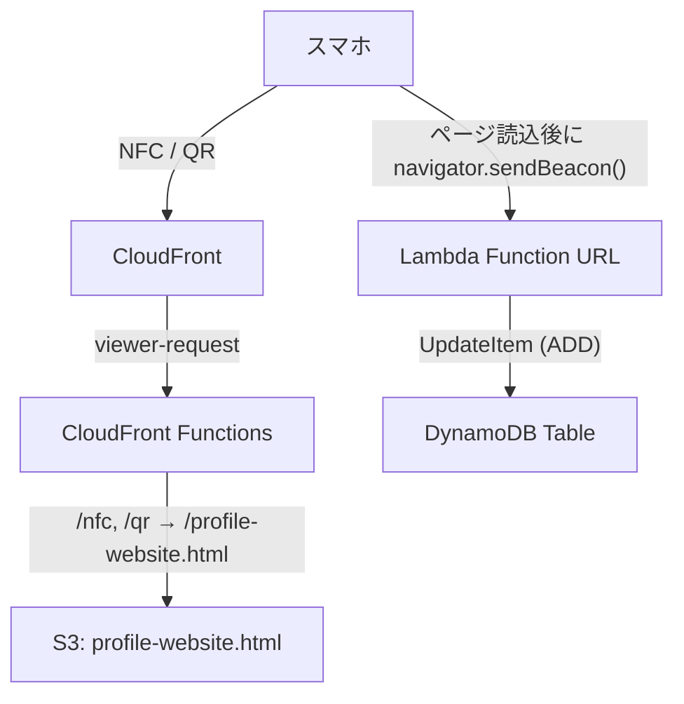

:::note
この記事は「2026 Japan AWS Jr. Champions 真夏のQiitaリレー」の3日目の記事となります。
過去の投稿（リンク集）は以下からご覧ください。
昨日投稿の記事も併せて記載します。
:::

https://qiita.com/ys-yoshida/private/6f7c7f85155a993e2c86

https://qiita.com/eureka_/items/cf4b7690dab316cceb1d

## はじめに

私は現在、勉強会に参加する際に、NFC名刺などを用いて自身のSNSアカウントなどを共有するようにしています。

https://qiita.com/ryu-ki/items/965d35a5b9abe86d0054

https://qiita.com/ryu-ki/items/82598335edeefe3e9e01

ふと、イベントで配ったあと実際に何人がアクセスしてくれたんだろう？と気になりました。

そこで、Google Analytics のような外部サービスを入れるほどでもないので、Lambda Function URL + DynamoDB というシンプルな構成でアクセスカウンターを作ることにしました。

## 前提環境

| 項目 | 内容 |
|---|---|
| AWS CDK | 2.1121.0（aws-cdk-lib ^2.252.0、TypeScript） |
| Lambda ランタイム | Python 3.12 |
| リージョン | us-east-1 |
| ディストリビューション | CloudFront + S3 で静的サイトをホスティング済み |

## アーキテクチャ



イベント規模のアクセス数であれば、Lambda（月100万リクエスト）と CloudFront Functions（月200万実行）は無料枠内です。DynamoDB はオンデマンドモードにリクエストの無料枠が無いため厳密には課金対象ですが、数千リクエストで月1円未満なので実質ほぼ0円で運用できます。

:::note
2025年7月15日以降に作成した AWS アカウントは、無料利用枠がクレジット制に変わっています。本記事の「無料枠」は従来プランのアカウントを前提にしています。
:::

## 設計のポイント

### Lambda Function URL の選定理由

今回の要件は単一エンドポイント・認証不要とシンプルなので、API Gateway のルーティングやステージ管理は不要です。Lambda Function URL の構成がシンプルかとおもいます。（あとGameDayなどでちょろっと触っただけなのでちゃんと触ってみたかった）

https://docs.aws.amazon.com/lambda/latest/dg/urls-configuration.html

### sendBeacon の選定理由

`navigator.sendBeacon()` はブラウザがバックグラウンドで送信してくれるので、ページ離脱時でも確実に送信され、ユーザー体験にも影響しません。カウンターのような送りっぱなしでOKな通信にはぴったりかと思います。

https://developer.mozilla.org/ja/docs/Web/API/Navigator/sendBeacon

### DynamoDB テーブル設計

| PK (`ref`) | SK (`date`) | `count` |
|---|---|---|
| nfc | 2026-06-25 | 42 |
| qr | 2026-06-25 | 15 |
| other | 2026-06-25 | 3 |

パーティションキー `ref` でアクセス元（nfc / qr / other）を、ソートキー `date` で日付（JST 基準）を表しています。`UpdateItem` の `ADD` 操作でインクリメントするため、同時アクセスでもカウントがずれないはずです。

https://docs.aws.amazon.com/amazondynamodb/latest/developerguide/Expressions.UpdateExpressions.html

## 実装

### Lambda 関数（Python）

```python
import boto3
import os
from datetime import datetime, timezone, timedelta

dynamodb = boto3.resource("dynamodb")
table = dynamodb.Table(os.environ["TABLE_NAME"])

JST = timezone(timedelta(hours=9))
ALLOWED_REFS = {"nfc", "qr"}  # ホワイトリスト方式。想定外の値は other に振り分け


def handler(event, context):
    method = event.get("requestContext", {}).get("http", {}).get("method", "")
    if method != "POST":
        # ブラウザで URL を直接開いた場合（GET）にカウントされないようにする
        return {"statusCode": 405}

    params = event.get("queryStringParameters") or {}
    ref = params.get("ref", "other")
    if ref not in ALLOWED_REFS:
        ref = "other"

    today = datetime.now(JST).strftime("%Y-%m-%d")

    # ADD はアイテムが無ければ自動作成 → 事前の PutItem 不要
    table.update_item(
        Key={"ref": ref, "date": today},
        UpdateExpression="ADD #c :inc",
        ExpressionAttributeNames={"#c": "count"},
        ExpressionAttributeValues={":inc": 1},
    )

    return {"statusCode": 204}
```

### CDK スタック（TypeScript）

```typescript
import * as cdk from 'aws-cdk-lib';
import * as dynamodb from 'aws-cdk-lib/aws-dynamodb';
import * as lambda from 'aws-cdk-lib/aws-lambda';
import { Construct } from 'constructs';

export class VisitorCounterStack extends cdk.Stack {
  constructor(scope: Construct, id: string, props?: cdk.StackProps) {
    super(scope, id, props);

    const table = new dynamodb.Table(this, 'VisitorCounterTable', {
      partitionKey: { name: 'ref', type: dynamodb.AttributeType.STRING },
      sortKey: { name: 'date', type: dynamodb.AttributeType.STRING },
      billingMode: dynamodb.BillingMode.PAY_PER_REQUEST, // 低トラフィック向けオンデマンド課金
      removalPolicy: cdk.RemovalPolicy.DESTROY, // スタック削除時にテーブルも削除
    });

    const fn = new lambda.Function(this, 'VisitorCounterFunction', {
      runtime: lambda.Runtime.PYTHON_3_12,
      handler: 'index.handler',
      code: lambda.Code.fromAsset('lambda/visitor-counter'),
      environment: { TABLE_NAME: table.tableName },
      timeout: cdk.Duration.seconds(10),
    });

    table.grantWriteData(fn); // CDK が最小限の IAM ポリシーを自動生成

    const fnUrl = fn.addFunctionUrl({
      authType: lambda.FunctionUrlAuthType.NONE,
      cors: { allowedOrigins: ['*'], allowedMethods: [lambda.HttpMethod.POST] },
    });

    new cdk.CfnOutput(this, 'CounterUrl', { value: fnUrl.url });
  }
}
```

:::note warn
Function URL は認証なし（`authType: NONE`）の公開エンドポイントです。URL を知っていれば誰でもカウントを増やせるため、あくまでざっくり傾向を知る用途向けです。
また、`removalPolicy: DESTROY` にしているため、スタックを削除するとカウントデータごとテーブルが消えます。
:::

### CloudFront Functions でのパス書き換え

NFC 名刺に書き込む URL は `https://example.com/?ref=nfc` のようにクエリパラメータで判別する方法もありますが、名刺に載せる URL としては格好悪いので、CloudFront Functions で `/nfc` `/qr` のようなクリーンなパスを用意し、内部的に HTML ファイルへ書き換えます。

https://docs.aws.amazon.com/AmazonCloudFront/latest/DeveloperGuide/cloudfront-functions.html

```javascript
// CloudFront Functions (viewer-request)
function handler(event) {
    var request = event.request;
    var uri = request.uri;

    if (uri === '/nfc' || uri === '/qr') {
        request.uri = '/profile-website.html';
    }

    return request;
}
```

ブラウザの URL バーには `/nfc` のまま表示され、S3 側には `/profile-website.html` のリクエストが届きます。

### HTML の変更

パスから `ref` を判定して、Lambda Function URL に beacon を送ります。

```html
<script>
    (function() {
        var COUNTER_ENDPOINT = 'https://xxxxx.lambda-url.us-east-1.on.aws/';
        var path = window.location.pathname;
        var ref = path === '/nfc' ? 'nfc' : path === '/qr' ? 'qr' : 'other';
        navigator.sendBeacon(COUNTER_ENDPOINT + '?ref=' + encodeURIComponent(ref));
    })();
</script>
```

## 動作確認

NFC 名刺をスマホにかざして `/nfc` を開くと、DynamoDB にカウントが記録されます。

カウントの確認用に、Function URL に GET でアクセスしたときは集計ダッシュボード（HTML）を返すようにも拡張してみました。ブラウザで直接 URL を開いて見る想定なので、GET を判定する分岐を 405 を返す判定の前に追加するだけです。

```python
def handler(event, context):
    method = event.get("requestContext", {}).get("http", {}).get("method", "")

    if method == "GET":
        return dashboard()  # DynamoDB を scan して集計表の HTML を返す

    if method != "POST":
        # ブラウザで URL を直接開いた場合（GET）にカウントされないようにする
        return {"statusCode": 405}

    ...
```

CDK 側は、scan で読み取り権限が必要になるため `grantWriteData` を `grantReadWriteData` に変更します。

```typescript
table.grantReadWriteData(fn); // scan（読み取り）も必要になったため書き込み専用から変更
```


日付ごと・アクセス元ごとのカウントが一目で確認できるようになりました。（QRコードつきの電子名刺を最初に提示するものの、カメラ起動してもらうのが面倒そうなので、スッとNFCカードを差し出す形になりがちで、ほぼQRコードは使われませんでした）

:::note
`scan` はテーブルの全件を読み取るため、今回のような規模のデータ量であれば問題ありませんが、件数が増えてくると読み取りコストやレイテンシが徐々に増えていきます。データが多くなってきたら `Query` への切り替えも検討する必要がありそうです。
:::

## おわりに

以上、Lambda Function URL + DynamoDB で、実質ほぼ0円で運用できる最小構成のアクセスカウンターを実装しました。CloudFront Functions によるパス書き換えも数行で済むので、NFC 名刺のように URL が直接見える場面では良いかもしれません。

ありがとうございました。
